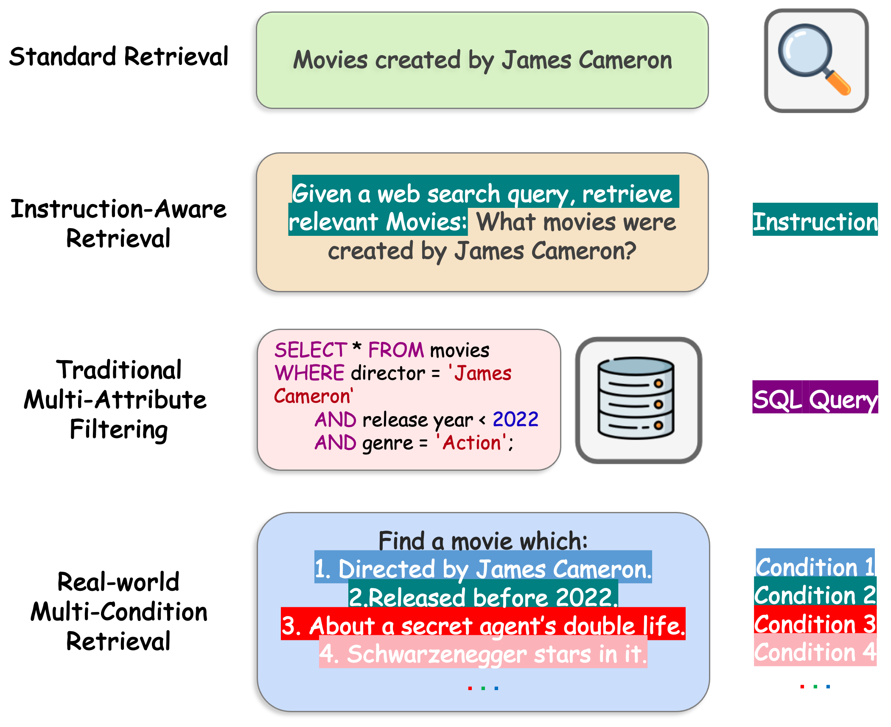
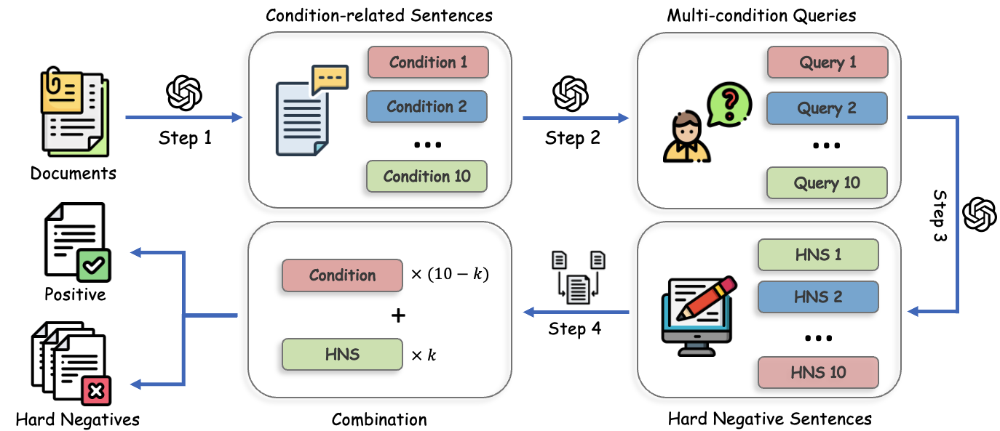

<h1 align="center"><b>MultiConIR: Towards Multi-Conditional Information Retrieval</b></h1>
<p align="center">
<a href="https://arxiv.org/pdf/2503.08046">
  </a> 
<a href="https://opensource.org/licenses/Apache-2.0">
  </a> 
<a href="https://github.com/EIT-NLP/MultiConIR/pulls">
    </a>
</p>

Information retrieval (IR) systems have become central to how we access knowledge in the digital age. However, there's a growing gap between users' complex search needs and the capabilities of current IR systems. While modern users frequently ask multi-faceted questions with multiple constraints ("Find me a thriller movie directed by Christopher Nolan that was released after 2010 and features time travel"), most IR systems and evaluation benchmarks are optimized for simpler, single-condition queries. We proposed **MultiConIR**, a novel benchmark specifically designed to evaluate retrieval and reranking models under multi-condition retrieval scenarios. Unlike existing datasets that primarily focus on single-condition queries from search engines, MultiConIR captures real-world complexity by incorporating five diverse domains: books, movies, people, medical cases, and legal documents.


<p align="center">
  
  <p align="center">From single-conditional retrieval to multi-conditional scenarios.</p>
</p>

## Overview

MultiConIR (Multi-Condition Information Retrieval) is a comprehensive benchmark aimed at evaluating retrieval models in scenarios involving queries with multiple conditions. Unlike traditional single-condition retrieval tasks, MultiConIR reflects realistic and complex search scenarios across five domains:

- Books
- Movies
- People
- Medical Cases
- Legal Documents

## Features

MultiConIR focuses on three key evaluation aspects:

1. **Complexity Robustness**: How effectively retrieval models handle queries with increasing complexity (1 to 10 conditions).
2. **Relevance Monotonicity**: Assessing if models maintain consistent relevance ranking when conditions progressively increase.
3. **Query Format Sensitivity**: Evaluating the stability of retrieval performance across instruction-style and descriptive-style queries.

## Dataset Construction
<p align="center">
  
  <p align="center">The construction pipeline of MultiConIR datasets.</p>
</p>

MultiConIR utilizes a structured and rigorous pipeline for dataset creation:

1. **Condition Sentence Extraction**: Identifies ten key, non-redundant condition sentences from real-world documents using GPT-4o.
2. **Query Generation**: Creates instruction-style (structured) and descriptive-style (natural language) queries with incremental conditions from 1 to 10.
3. **Hard Negative Generation**: Produces semantically similar yet subtly distinct negative sentences to challenge retrieval systems.

## Benchmark Tasks

MultiConIR defines three comprehensive evaluation tasks:

- **Complexity Robustness**: Measures how retrieval performance is affected as the number of conditions in queries increases.
- **Relevance Monotonicity**: Evaluates models’ ability to rank documents consistently based on the number of conditions matched.
- **Query Format Invariance**: Assesses model sensitivity to different query formulations (instruction-style vs descriptive-style).

## Performance Highlights
- Traditional IR systems deteriorate as query conditions increase, with rerankers suffering more severely.
- Models demonstrate systematic failure in maintaining relevance monotonicity across conditions.
- Reranking models outperform retrievers on simpler queries but experience significant performance drops as query complexity rises.
- Mean pooling focuses on early query conditions while `<EOS>` pooling biases toward later conditions
- **GritLM-7B** demonstrates the highest robustness against increased query complexity.
- **NV-Embed** shows exceptional adaptability to longer documents, maintaining performance stability better than other models.


## Getting Started

### Installation

Clone this repository and install dependencies:

```bash
git clone https://github.com/EIT-NLP/MultiConIR.git
cd MultiConIR
pip install -r requirements.txt
```

### Data and Models

Datasets and scripts for evaluation are provided in the repository. Refer to the `datasets` and `models` folders for further details.

## Citation

Please cite our paper if you use MultiConIR in your research:

```bibtex
@misc{lu2025multiconirmulticonditioninformationretrieval,
      title={MultiConIR: Towards multi-condition Information Retrieval}, 
      author={Xuan Lu and Sifan Liu and Bochao Yin and Yongqi Li and Xinghao Chen and Hui Su and Yaohui Jin and Wenjun Zeng and Xiaoyu Shen},
      year={2025},
      eprint={2503.08046},
      archivePrefix={arXiv},
      primaryClass={cs.IR},
      url={https://arxiv.org/abs/2503.08046}, 
}
}
```


## Contact

For questions or feedback, please reach out to <lux1997@sjtu.edu.cn>.

